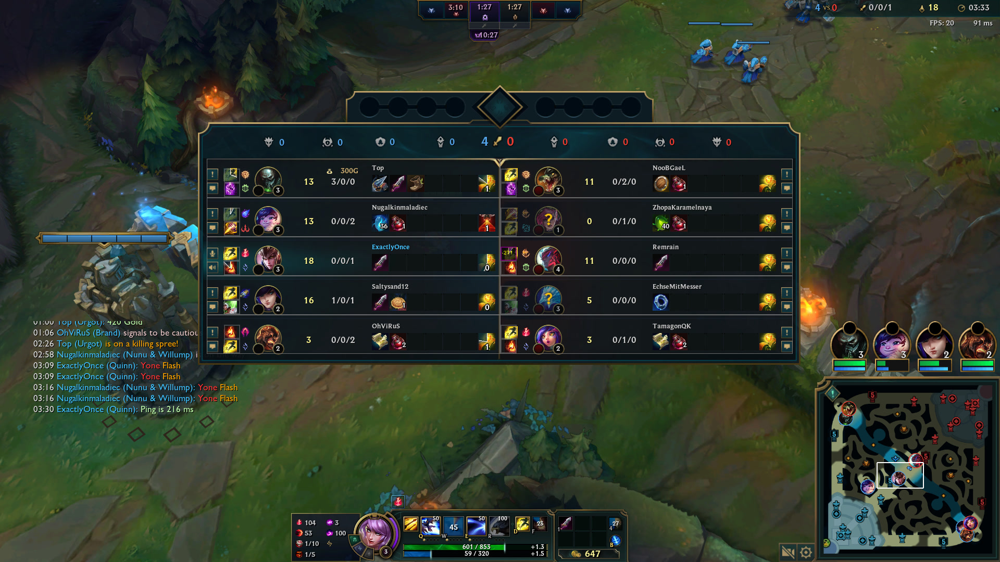

<!--
Target audience: Tech-savvy, but may not be familiar with League.
Purpose: Inform.
Status: Draft

Post intro:
That's one small step for me, one giant leap for my journey in learning animation and beyond.
-->
# Introducing Super Scoreboard: Tracking cooldowns without even thinking

Building a cooldown tracker is simple. Anyone can do it. Many people have done it.

Super Scoreboard is nothing super or extraordinary.

I just wanted to make my own thing but braindead easy to use.

This post starts by briefly introducing League, one of its mechanics, and common convnetions that players have adopted.
Then, we explain the problem, existing solutions, a high level overview of our design and implementation.


## Intro

League of Legends (League) is a team-oriented strategy video game. Information and communication are important to plan, coordinate, and make "plays".

In addition to each character's intrinsic moves (**Abilities**), the player can select 2 generic moves (Summoner Spells or **Summs**).
Knowing when an enemy has a strong ability (e.g. their Ultimate Ability) or an important summ (e.g. Flash) is can determin the outcome of a "play," a duel, a team fight, a rotation, etc.

Players use their fallible human memory and mental calculations to keep track of when an ability was used and when it would be off cooldown (meaning, when it's usable again). I could never.

League might be toxic, but... It is what it is.


## League conventions

Despite the limited communication tools given to players, a few useful conventions evolved:

To track cooldowns, you open the scoreboard by pressing <kbd>TAB</kbd> and "ping" (click) the used summ. Its name alongside a timestamp (current time) will be logged to the team's chat.
You or your teammates can use that piece of information to calculate when it will be off cooldown and make decisions based on that info.

For example, Flash has a cooldown of 5 minutes. If an enemy flashes at 04:53, they will be able to use it again after 09:53.

Let's see how players use pings:

### Pinging multiple times

Pinging multiple times to signal that a summ has just been used.

Notice that there is some delay (a few seconds) between when the moment a summ is used and it gets pinged by the player.

<figure>
<video controls src="./quinnad-twice-after-surviving.mp4"></video>
<figcaption>Quinn (QuinnAD) pinging Sett's Flash after 9 seconds (once the fight concluded)</figcaption>
</figure>

<figure>
<video controls src="./quinnad-twice-after-dying.mp4"></video>
<figcaption>Quinn (QuinnAD) pinging Twisted Fate's Flash after 5 seconds (after dying)</figcaption>
</figure>

### Pinging once

Pinging once to say "hey, their summ is on cooldown, we can use this to our advantage."

<figure>
<video controls src="./quinnad-once.mp4"></video>
<figcaption>Quinn (QuinnAD) pinging Sett's Flash once.</figcaption>
</figure>

### Spam pinging and muting players

Spam pinging teammates to harass them. Classic toxicity.

But on the bright side, look at the Mute Player button.
Its design is kinda cool:
- You long press the chat icon/button to mute or unmute someone.
- Its border serves as a loading indicator (how long you still need to keep pressing).

<figure>
<video controls src="./kayle1v9-muting-riven.mp4"></video>
<figcaption>Kayle (Kayle 1v9) muting Riven</figcaption>
</figure>

## Cooldown trackers

Having to keep track of each spell and mentally calculate when it will be usable again sounds tedious and can be complex if you take into account all summs (2 x 5), each one has different cooldowns, and the fact that the a summ's cooldown may change depending on the player's items and runes.

That's why people use third-party party apps to help them keep track of cooldowns--cooldown trackers or "summoner spell timers".
Apps like U.GG (which QuinnAD used to use) or Porofessor (which Kayle 1v9 uses).

<figure>
<video controls src="./kayle1v9-porofessor.mp4"></video>
Kayle (Kayle 1v9) pinging Tahm Kench's TP on the Porofessor widget (and not the scoreboard).
</figure>


Notice that the player ends up only tracking using the app, not sharing it with their teammates. Info is not shared with the teammates.
Or, they have to repeat the same task: Using the widget/overlay to record the summ and then pinging it via the in-game scoreboard, like with (even more) inaccuracy.

In either case, I think the experience is "ungood".

We could do better. Like, imagine...


### Imagine...

Imagine if, instead of juxtaposing the widget or overlay on the side, it was superimposed on top of the in-game scoreboard.

Imagine if you could start tracking cooldowns without even thinking, simply relying on your muscle memory (pinging summs) and using familiar UI patterns (like the Mute Player button).

Imagine if we could ping spells to team chat (via the in-game scoreboard) and start tracking it (as overlays) without having to repeat the action in two different places.

Super Scoreboard is what I imagined and tried to realize.
- Superimposed (overlayed) on top of the in-game scoreboard.
- Taking delays into account (assumes it is 7 seconds, can be changed by the user).
- Multiple clicks on a spell starts its timer.
- Long pressing a spell unsets its timer (_a la_ Mute Player button).

**What** it does is unimpressive, but you might be interested in knowing **how** it works...


<figure>

<figcaption>Quinn (that would be me) pinged Yone's Flash. Its cooldown timer (yellow text inside a purple box) is drawn on top of the in-game scoreboard, and it got logged to team chat (left box)</figcaption>
</figure>

Why no video? Laptop is omega shit, just look at my FPS and ping.
I can barely run League, let alone an IDE (Eclipse), the game, and a video capture software (e.g. OBS)...
A screenshot is the best I could do.


## Animated explainer

Filters and effects:

- Mouse clicked by user (hand cursor pulse animation)

- Mouse events (marching ants animation from cursor to window)

- An active window radiates (neon light)
https://codemyui.com/neon-tube-text-animation-with-flicker-and-glow/

- Inactive: filter: grayscale
https://developer.mozilla.org/en-US/docs/Web/CSS/filter

Legend:
- Dashed line (---) Electrical signals
- Solid line (___) Messages
- Dotted line (...) Events

Script:
```
JS: Show dark scene
SAY: In the beginning, there was darkness.

SAY: And then someone booted Windows.
JS:  SHOW WHITE SCENE, WINDOWS RECT

SAY: The user interacts with the system using a mouse.
JS: SHOW CURSOR, PULSING
SAY: The mouse sends electrical signals to the system.
JS: SHOW DASHED LINE FROM CURSOR TO WINDOW RECT

SAY: The system processes them. Look at how it glows!
JS: WINDOWS RECT GLOW

SAY: It forwards mouse events to the topmost window (if any) for further processing.

SAY: The user initially basked in the purity of Windows' divine glow.
Yet, they succumbed to the allure of League of Legends, a departure from the sacred. The once pristine Windows interface now bears the mark of digital temptation.

SAY:
League is open. Mouse events are forwarded to it.
Overlay is open. Mouse events are forwarded to it.
League does not receive events. Sad.
Overlay tells Windows to not forward mouse events.
Overlay does not receive events. Sad.
Overlay asks Windows to tell it about global mouse events.
Overlay forwards global mouse events to itself. It processes them as if they were forwarded directly to it.

SAY:
Now, both League and the overlay now independently process the same click events. This allows the user to perform actions in both the game (pinging via in-game scoreboard) and the overlay (tracking with Super Scoreboard) simultaneously.
JS: GLOW WINDOWS, LEAGUE, and OVERLAY RECT.

SAY: Epic.
```


## Conclusion

And there you have it, Super Scoreboard, an overlay that's superimposed onto the in-game scoreboard. Super simple to use.
It's a proof-of-concept.
It works well enough.

Quinn is cool.

Check it out on GitHub https://github.com/djalilhebal/super-scoreboard/

---

**Details**:

- Tested on 14.4 (Normal and Quickplay).

**Credits**:

Clips were downloaded from:

- QuinnAD's Twitch channel (https://www.twitch.tv/quinnad)
    * `quinnad-twice-after-surviving.mp4`, `quinnad-twice-after-dying.mp4`, `quinnad-once.mp4`:
      QuinnAD, 2024-02-22

- Kayle 1v9's Twitch channel (https://www.twitch.tv/kayle_1v9)
    * `kayle1v9-muting-riven.mp4`
    * `kayle1v9-porofessor.mp4`: Kayle 1v9, 2024-02-27 00:23:15

The animated explainer was made using:
- Inkscape (vector editor)
- Shotcut (video editor)
- OBS (screen recorder)
- TTSMaker (https://ttsmaker.com/)
    * Voice: "Peter-🇺🇸United States Male (Hot + Unlimited)"

Music:
    * Hackers https://www.youtube.com/watch?v=Qr1PgL79deQ

---

FIN.
