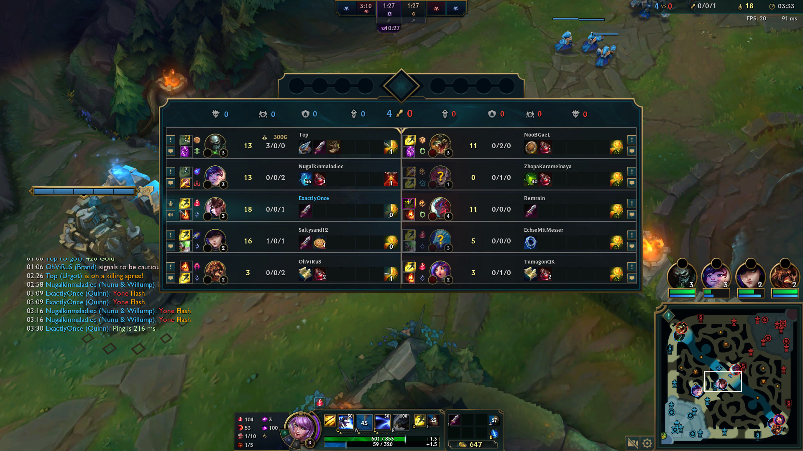

<!--
Target audience: Tech-savvy, but may not be familiar with League.
Purpose: Inform.
Status: Draft

- date: 2024-03-08
-->
# Introducing Super Scoreboard: Tracking cooldowns without even thinking

Building a cooldown tracker is simple. Anyone can do it. Many people have done it.

Super Scoreboard is nothing super or extraordinary.

I just wanted to build my own thing but make it braindead easy to use.

In this post, we will start by giving a brief introduction to League of Legends, one of its mechanics known as cooldown tracking, and a common practice among players called pinging. 
Following that, we will discuss a specific need, the current solutions available, and finally, present our streamlined solution.
We will provide a high-level overview of our design and implementation.

## Intro

League of Legends (League) is a team-oriented strategy video game. Information and communication are important to plan, coordinate, and make "plays".

In addition to each character's intrinsic moves (**Abilities**), the player can select 2 generic moves (Summoner Spells or **Summs**).
Knowing when an enemy has a strong ability (e.g. their Ultimate Ability) or an important summ (e.g. Flash) can determine the outcome of a "play," a duel, a teamfight, a rotation, etc.

Players use their "fallible" human memory and mental calculations to keep track of when an ability was used and when it would be off cooldown (meaning, when it would be usable again). I could never.

League might be toxic, but... It is what it is.

## League conventions

Despite the limited communication tools given to players, a few useful conventions have evolved:

To track cooldowns, you open the scoreboard by pressing <kbd>TAB</kbd> and "ping" (click) the used summ. Its name alongside a timestamp (current time) will be logged to the team's chat.
You or your teammates can use that piece of information to calculate when it will be off cooldown and make decisions based on that info.

Let's take **Flash** as an example.
It allows a player to instantly teleport their champion a short distance, serving as an escape or combat tool.  
Visually, it is represented by a quick, bright burst of light around the champion followed by a sudden disappearance and reappearance at the target location.  
Flash has a cooldown of 5 minutes. If an enemy flashes at 04:53, they will be able to use it again after 09:53.

Let's see how players use pings:

### Representative example

In the following video, you can see this sequence of events/actions:
- Renekton flashed to kill Quinn.
- Quinn pings this summ. It appears on the team's chat alongside a timestamp.
It reads something like `[Team] MM:SS Pantheon Flash`.
- Quinn calculates and types when his Flash would be up again (just for the record).
MM:SS = MM:SS + 5.
- Knowing that his flash is obviously down, Quinn went back and killed him. That was a "play".

Quinn (QuinnAD) vs Pantheon, death and return kill.
`quinnad-timing-flash--2024-03-08--raw.mp4`

### Pinging multiple times

Pinging multiple times to signal that a summ has just been used.

Notice that there is some delay (a few seconds) between when a summ is used and when it gets pinged by the player.

<figure>
<video controls src="./quinnad-twice-after-surviving.mp4"></video>
<figcaption>Quinn (QuinnAD) pinging Sett's Flash after 9 seconds (once the fight concluded)</figcaption>
</figure>

<figure>
<video controls src="./quinnad-twice-after-dying.mp4"></video>
<figcaption>Quinn (QuinnAD) pinging Twisted Fate's Flash after 5 seconds (after dying)</figcaption>
</figure>

### Pinging once

Pinging once to say "Hey, their summ is on cooldown, we can use that to our advantage."

<figure>
<video controls src="./quinnad-once.mp4"></video>
<figcaption>Quinn (QuinnAD) pinging Sett's Flash once.</figcaption>
</figure>

### Spam pinging and muting players

Spam pinging teammates to harass them. Classic toxicity.

But on the bright side, look at the Mute Player button.
Its design is kinda cool:
- You **long press** the chat icon/button to mute or unmute someone.
- Its border serves as a loading indicator (how long you still need to keep pressing).

<figure>
<video controls src="./kayle1v9-muting-riven.mp4"></video>
<figcaption>Kayle (Kayle 1v9) muting Riven.</figcaption>
</figure>

## Cooldown trackers

Having to keep track of each spell (ability or summ) and mentally calculate when it will be usable again sounds tedious and can be complex if you take into account all summs (2 x 5), each one has a different cooldown, and the fact that a summ's cooldown may change depending on the player's items and runes.

That's why people use third-party apps to help them keep track of cooldowns--cooldown trackers or "summoner spell timers".
Apps like U.GG (which QuinnAD used to use) or Porofessor (which Kayle 1v9 uses).

<figure>
<video controls src="./kayle1v9-porofessor.mp4"></video>
<figcaption>Kayle (Kayle 1v9) pinging Tahm Kench's TP only using the 3rd party overlay.</figcaption>
</figure>

<figure>
<video controls src="./kayle1v9-porofessor-tracking-pinging.mp4"></video>
<figcaption>Kayle (Kayle 1v9) tracking Aatrox's Flash using an overlay and then pinging it in-game.</figcaption>
</figure>

Notice that the player ends up only tracking summs via the overlay, not sharing that info with their teammates.  
Or, they have to repeat the same task: Using the widget/overlay to record the summ and then pinging it via the in-game scoreboard, with even more inaccuracy/delay.

In either case, I think the experience is "ungood".

We could do better. Like, imagine...

### Imagine...

Imagine if, instead of juxtaposing the widget or overlay on the side, it was superimposed on top of the in-game scoreboard.

Imagine if you could start tracking cooldowns without even thinking, simply relying on your muscle memory (pinging summs) and using familiar UI patterns (like the Mute Player button).

Imagine if we could ping spells to team chat (via the in-game scoreboard) and start tracking it (via an overlay) without having to repeat the action in two different places.

**Super Scoreboard** is what I imagined and tried to realize:
- Superimposed (overlayed) on top of the in-game scoreboard.
- Taking delays into account (assumes it is 7 seconds, can be changed by the user).
- Multiple clicks (e.g. double click) on a spell starts its timer.
- Long pressing a spell unsets its timer (_a la_ Mute Player button).

**What** it does is unimpressive, but you might be interested in knowing **how** it works...

<figure>

<figcaption>Quinn (ExactlyOnce, that would be me) pinged Yone's Flash. Its cooldown timer (yellow text inside a purple box) is drawn on top of the in-game scoreboard, and it got logged to team chat (left box)</figcaption>
</figure>

PS: Why no video? My laptop is omega shit, just look at my FPS and ping.
I can barely run League, let alone an IDE (Eclipse), the game, and video capture software (e.g. OBS)...
A screenshot is the best I could do.

## How it works

The following video explains the main idea behind Super Scoreboard and how it's possible to interact with two windows at the same time.

- The game client is running in a _borderless_ mode (meaning, it is a regular window and, unlike true fullscreen mode which has exclusive access to the display).

- The overlay is always superimposed on top of the game client (the overlay is _always on top_).

- Relying on system calls (WinAPI), the overlay:
    * Asks to make it not receive mouse events, rendering it clickthrough. Mouse events are **not forwarded** to it for further processing.
    * Asks to be **informed** of global mouse events.
    * Sends global mouse events to itself, as if they were forwarded to it for processing.
    * Processes them like normal.

- Now, the user practically clicks on two different windows at the same time. They interact with both the overlay and League at the same time.

<figure>
<video controls src="./explainer--2024-03-08.mp4"></video>
<figcaption>A cringe animated explainer (FIRST ATTEMPT)</figcaption>
</figure>

<aside>

**Legend**:
- Dashed line: Electrical signals.
- Solid line: Messages or one-off messages.
- Dotted line: Events or continuous messages.
- Glowing means the window is processing mouse events.

</aside>

About the animated explainer

It was supposed to have synthwave vibes, what with neon lights and all.

I was going for a dramatic narration, but I switched to a "snappy" style to keep the video short. I even dropped articles (the/a/ an).

Filters and effects:

- [ ] The cursor icon should be filled.
- [x] Mouse clicks (hand cursor pulse animation).
- [x] Mouse events (marching ants animation from cursor to window).
- [ ] One-off messages should fade away.
- [ ] An active window radiates (neon glow). Implemented, but can be better:
    * [ ] [Neon Tube Text Animation with Flicker and Glow – CodeMyUI](https://codemyui.com/neon-tube-text-animation-with-flicker-and-glow/)

## Conclusion

And there you have it, Super Scoreboard, an overlay that's superimposed onto the in-game scoreboard. It's dead simple to use.  
It's a proof-of-concept.  
It works well enough.  

Also, Quinn is cool.

Check it out on GitHub https://github.com/djalilhebal/super-scoreboard/

---

**Credits**:

Clips:

- QuinnAD
    * `quinnad-twice-after-surviving.mp4`, `quinnad-twice-after-dying.mp4`, `quinnad-once.mp4`:
    QuinnAD's Twitch channel (https://www.twitch.tv/quinnad), 2024-02-22

- Kayle 1v9
    * `kayle1v9-muting-riven.mp4`: Kayle 1v9's Twitch stream (https://www.twitch.tv/kayle_1v9)
    * `kayle1v9-porofessor.mp4`: Kayle 1v9's Twitch stream, 2024-02-27 00:23:15
    * `kayle1v9-porofessor-tracking-pinging.mp4`: Kayle 1v9's YouTube channel, 05:30 https://www.youtube.com/watch?v=VSRWuEU1EQ0

---

**Details**:

- Last tested on League Patch 14.4 (Normal and Quickplay).

---

The animated explainer was made using:

- **Inkscape** (vector editor)

- **Firefox** (to render and interact with the SVG)

- ~~**OBS** (screen recorder)~~ installed as a snap, did not work on Kubuntu.

- **SimpleScreenRecorder** (https://www.maartenbaert.be/simplescreenrecorder/)

- **TTSMaker** (https://ttsmaker.com/)
    * Voice: "Peter - United States Male (Hot + Unlimited)"

- **Shotcut** (video editor)

- Music:
    * [x] [Last Stop - Karl Casey @ White Bat Audio](https://www.youtube.com/watch?v=jZoFzZ8pBmg)
    * [ ] [Hackers - Karl Casey @ White Bat Audio](https://www.youtube.com/watch?v=NZ4Of3lID84)

- Animating the SVG
    * [x] Custom script (see `super-scoreboard-explainer.js`)
    * [ ] Motion Canvas (https://motioncanvas.io/)
    * [ ] GSAP (https://github.com/greensock/GSAP)
    * [ ] Snap.svg (http://snapsvg.io)
    * [ ] SVG.js (https://svgjs.dev/docs/3.0/)

---

FIN.
