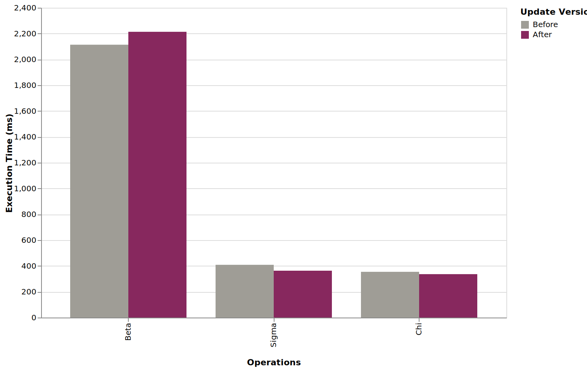
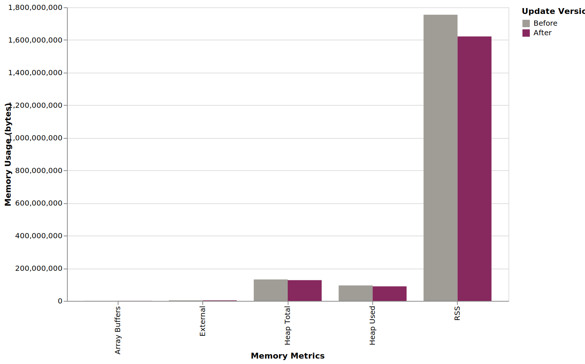
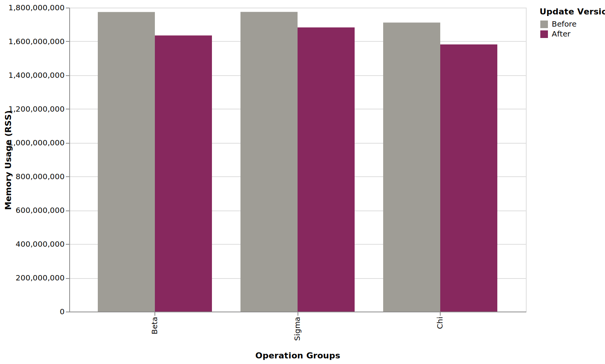
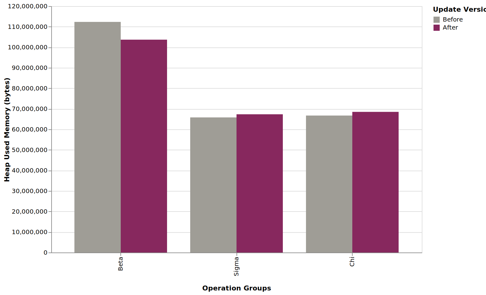

# Red Queen's race and the software development process

<figure>

</figure>

<figure>
<video controls autoplay loop muted src="./alice-1985__clip-1.mp4"></video>
<figcaption>
Red Queen and Alice, running and shouting, "Faster! Faster!"

-- [Alice in Wonderland (1985)][alice-1985]
</figcaption>
</figure>

Imagine this: Your project manager asks why you've been focusing on optimization for months, but the app's performance is still lacking.

I could say, '**Trust the process**,' but let me explain with a colorful metaphor: Red Queen's race.
As we add new features, the app slows down, and developers must optimize it to maintain its previous performance and, ideally, improve it.

Optimization is like the Red Queen’s Race, a concept from Alice Through the Looking-Glass. Describing her world, the Queen declares, “It takes all the running you can do, to keep in the same place. If you want to get somewhere else, you must run at least twice as fast as that!” As new features and calculations are added, the app slows down. Developers must continually optimize—improving memory usage and reducing execution time—not to get ahead, but simply to maintain an acceptable baseline.

Refactoring works the same way: it helps prevent the system from becoming overly complex and drowning in technical debt.

## Into the concrete

Initially, there was only 1 resource-intensive operation: Chi. \
With time, we added many other operations, but the slowest ones are Beta and Sigma. \
This is why we picked Chi, Beta, and Sigma for testing.

Optimization technique:

When using an ORM (say, TypeORM), instead of using `leftJoinAndSelect` (selecting all fields),
we should use `leftJoin` and then `select([...only_required_fields])`.

I know it is a best practice, but convenient ORM features make us lazy.
Also, manually specifying each field can be somewhat overwhelming (PS: there are about two dozen required fields per query).

---

Here are some numbers and charts to back it up.

Operations:
- **Operation Chi**
- **Operation Beta**
- **Operation Sigma**

### Results

#### Execution time

<figure>


<figcaption>
Average execution time, grouped by operation type.

Note: Lower is better.
</figcaption>
</figure>

On average, each updated operation is slower by 5 ms, which is irrelevant given the test setup.

#### Memory usage

<figure>


<figcaption>
Average memory usage.

We notice improvement on all metrics.

Note: Lower is better.
</figcaption>
</figure>

<figure>


<figcaption>
Memory usage (RSS metric), by operation type.

**Key observations**:
- Operation Chi: RSS decreased by 7.56% (from 1,711,407,309 to 1,581,969,954)
- Operation Beta: RSS decreased by 7.83% (from 1,773,921,758 to 1,635,025,579)
- Operation Sigma: RSS decreased by 5.18% (from 1,774,633,506 to 1,682,619,870)

All groups show a reduction in memory usage, with Beta experiencing the largest percentage decrease.

Note: It includes memory used by workers.
</figcaption>
</figure>


<figure>

<figcaption>
Memory usage (HeapUsed metric), grouped by operation type.
</figcaption>
</figure>

### Methodology

Each operation was executed multiple times (5 times each), and memory usage and execution time metrics were logged in a structured way ([JSON Lines][jsonl]).

Next, the results were aggregated and averaged.

Finally, results are visualized as bar charts for ease of comparison. Charts were generated declaratively using [Vega-Lite][vega-lite].

## Conclusion

Optimization isn’t a one-time task but an ongoing effort. It's part of the process. **Trust the process.**

Me to my PM:
<figure>
<video controls src="./alice-1985__clip-2.mp4"></video>
<figcaption>

- You may rest a little now.

- But we haven't gotten anywhere.

- If you wanted to get anywhere, you'd have to run twice as fast as you did.

-- [Alice in Wonderland (1985)][alice-1985]
</figcaption>
</figure>


## Appendix

### Workers

We use Node workers, so we are mainly interested in the `rss` metric.

```ts
// It uses `perf_hooks` for accurate measurement.
withExecutionTime(logger, fn);

// It uses `global.gc()` before measurement to reduce interference from previous operations
// It uses `process.memoryUsage()` to gather memory usage data.
withMemoryUsage(logger, fn);
```

Example:
```ts
// Adds an entry
await withMemoryUsage(logger, async () => {
  await omegaSlowOperation();
});
```

Relevant files:
- [`wrappers.ts`](./code-snippets/wrappers.ts): `withExecutionTime` and `withMemoryUsage`.
- [`jsonl-logger.ts`](./code-snippets/jsonl-logger.ts): Default logger.
- [`before-after.cjs`](./code-snippets/before-after.cjs): Comparison script, generated by ChatGPT.
- [`bar-chart.vega.json`](./code-snippets/bar-chart.vega.json): Vega-Lite template.

### NestJS

Ensure the project is built (`npm run build`).

Then run:
```sh
node --expose-gc dist/main.js
```

<!-- LINK DEFS -->
[red-queens-race]: https://en.wikipedia.org/wiki/Red_Queen%27s_race
[node-processmemoryusage]: https://nodejs.org/api/process.html#processmemoryusage
[jsonl]: https://jsonlines.org/
[vega-lite]: https://vega.github.io/vega-lite/
[alice-1985]: https://www.imdb.com/title/tt0088693/

---

FIN.
